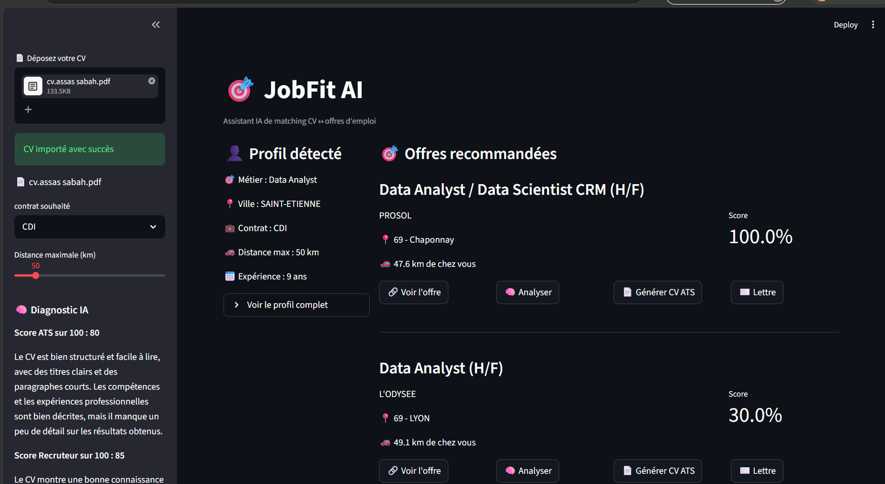
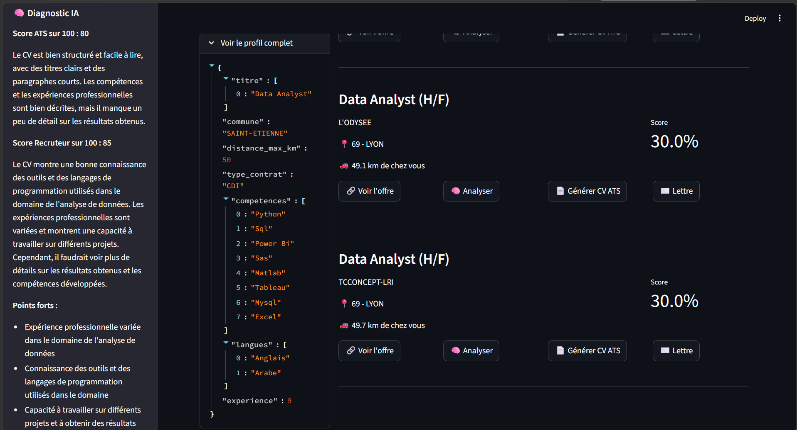
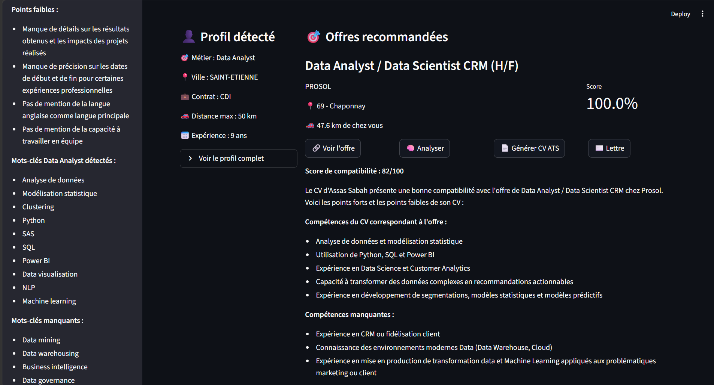
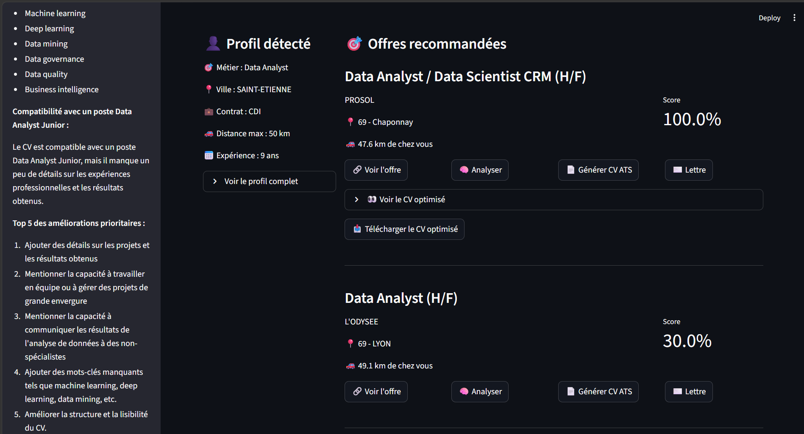
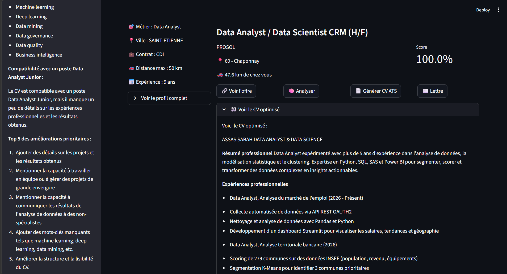

# 🎯 JobFit AI

**Assistant IA de matching entre CV et offres d'emploi**

[]()
[]()
[]()
[]()

---

#  Table des matières

- [Description du projet](#description-du-projet)
- [Objectifs du projet](#objectifs-du-projet)
- [Fonctionnalités](#fonctionnalités)
- [Aperçu de l'application](#aperçu-de-lapplication)
- [Données et sources](#données-et-sources)
- [Technologies utilisées](#technologies-utilisées)
- [Structure du projet](#structure-du-projet)
- [Étapes principales](#étapes-principales)
- [Compétences développées](#compétences-développées)
- [Résultats](#résultats)
- [Démo](#démo)
- [Auteur](#auteur)

---

# Description du projet

JobFit AI est une application développée avec **Python** et **Streamlit** permettant d'accompagner un candidat dans sa recherche d'emploi.

À partir d'un CV au format PDF, l'application :

- analyse automatiquement le profil du candidat ;
- extrait les informations importantes (métier, compétences, expérience, langues, localisation) ;
- recherche des offres d'emploi via l'API France Travail ;
- calcule un score de compatibilité avec chaque offre ;
- fournit un diagnostic du CV grâce à un modèle d'intelligence artificielle ;
- génère un CV optimisé et une lettre de motivation adaptés à l'offre sélectionnée.

L'objectif est d'automatiser plusieurs étapes du processus de candidature afin d'aider les candidats à cibler les offres les plus pertinentes.

---

# Objectifs du projet

## Objectifs fonctionnels

- Automatiser l'analyse d'un CV
- Identifier automatiquement le profil d'un candidat
- Rechercher des offres d'emploi pertinentes
- Calculer un score de compatibilité CV ↔ offre
- Générer un diagnostic du CV
- Générer un CV optimisé ATS
- Générer une lettre de motivation personnalisée

## Objectifs personnels

- Développer une application IA complète
- Travailler avec plusieurs API
- Concevoir une architecture modulaire en Python
- Approfondir l'utilisation des modèles de langage (LLM)
- Développer une interface interactive avec Streamlit

---

#  Fonctionnalités

-  Import d'un CV PDF
-  Analyse automatique du CV
-  Détection du métier, des compétences, de la localisation et de l'expérience
-  Recherche d'offres via l'API France Travail
-  Calcul d'un score de matching
-  Filtrage par distance
-  Filtrage par type de contrat
-  Diagnostic IA du CV
-  Génération d'un CV optimisé ATS
-  Génération d'une lettre de motivation

---

#  Aperçu de l'application

## Interface principale

L'utilisateur importe son CV, choisit son type de contrat ainsi que la distance maximale souhaitée. L'application récupère automatiquement les offres France Travail correspondant à son profil.



---

## Détection automatique du profil

Le CV est analysé afin d'extraire automatiquement :

- métier recherché
- compétences
- langues
- expérience
- localisation



---

## Analyse IA du matching

Pour chaque offre, JobFit AI réalise une analyse complète comprenant :

- score de compatibilité
- compétences détectées
- compétences manquantes
- mots-clés ATS
- recommandations d'amélioration



---

## Génération d'un CV optimisé

Grâce au LLM, une nouvelle version du CV est automatiquement générée afin d'améliorer les chances de passer les filtres ATS.



---

## Téléchargement du CV

Le CV optimisé peut ensuite être téléchargé directement au format PDF.



---

#  Données et sources

## Source principale

- API France Travail

Les offres d'emploi sont récupérées en temps réel.

Informations exploitées :

- Intitulé du poste
- Description
- Entreprise
- Localisation
- Type de contrat
- Expérience
- Compétences
- Langues

---

# Technologies utilisées

- Python
- Streamlit
- Pandas
- Requests
- Geopy
- PyPDF2
- ReportLab
- API France Travail (OAuth2)
- Groq LLM
- Git / GitHub

---

#  Structure du projet

```text
jobfit-ai/

├── images/
├── src/
│   ├── api.py
│   ├── matching.py
│   ├── cv_parser.py
│   ├── llm.py
│   ├── pdf_generator.py
│   ├── ai_diagnostic.py
│   └── ui.py
│
├── app.py
├── requirements.txt
├── .gitignore
└── README.md
```

---

# Étapes principales

1. Import du CV
2. Extraction des informations
3. Analyse du profil
4. Connexion à l'API France Travail
5. Recherche des offres
6. Calcul du score de compatibilité
7. Diagnostic IA
8. Génération du CV optimisé
9. Génération de la lettre de motivation

---

# Compétences développées

- Développement Python
- Intégration d'API REST
- Authentification OAuth2
- Traitement automatique de documents PDF
- Data Processing
- Prompt Engineering
- Développement d'applications Streamlit
- Géolocalisation
- Versioning Git / GitHub

---

# Résultats

Cette application permet :

- d'automatiser l'analyse d'un CV ;
- d'identifier les offres d'emploi les plus pertinentes ;
- d'expliquer le score de compatibilité ;
- de proposer un diagnostic du CV ;
- de générer des documents de candidature personnalisés.

---

# Démo

**Application en ligne**

 https://jobfit-ai-lft9i2aue5kshzheqvlw8m.streamlit.app/

---

#  Auteur

**Sabah ASSAS**

Master en Mathématiques – Recherche Opérationnelle  
Data Analyst | Data Science | Intelligence Artificielle

GitHub : https://github.com/sabah42
